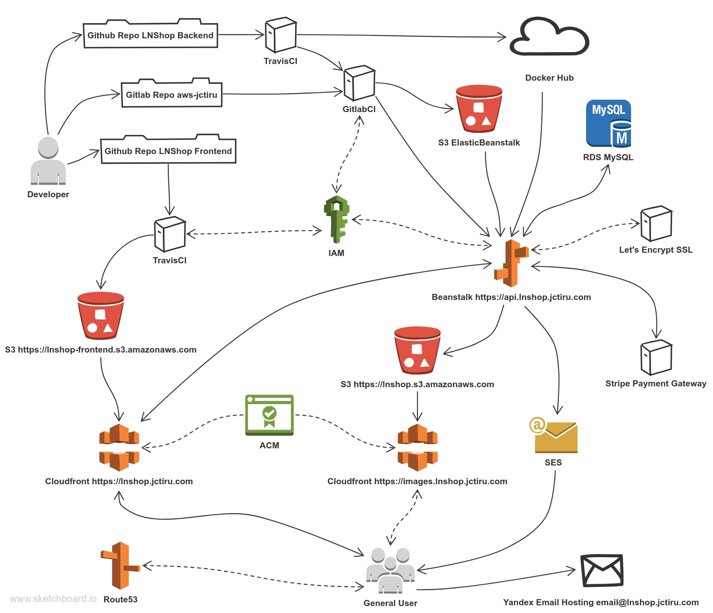

# LNShop

## Live Link

- Frontend - <https://lnshop.jctiru.com>
- Backend - <https://api.lnshop.jctiru.com>

## Overview

A Light Novel eCommerce website. Java using Spring Boot for backend and React SPA for frontend.

Backend hosted on AWS Elastic Beanstalk with multi-docker config. EC2 instance on public subnet while AWS RDS on private subnet. Frontend assets on AWS S3. Image uploads are on S3 too. Both S3 buckets are behind AWS CloudFront CDN and are not directly accessible except only through AWS CloudFront by using Origin Access Identity. AWS Cloudfront SSL/TLS certificates for custom domain are provided by AWS ACM. Outbound emails are handled by AWS SES while inbound emails are handled by Yandex which provides free email hosting with custom domain. Stripe is used for payment processing. Domain registration and DNS service handled by AWS Route53.

Frontend repo goes through TravisCI pipeline which builds the assets and uploads to S3 bucket. Backend repo also goes through TravisCI pipeline which builds and uploads the docker image to Docker Hub, then triggers a central GitlabCI pipeline which handles deployment to Elastic Beanstalk for all projects (includes other projects which are also hosted in the same single EC2 instance). Traefik is used as reverse proxy for multiple containers and to automate Let's Encrypt SSL/TLS certificate generation/management.

## Project Flow Diagram

## Inside Elastic Beanstalk

## React SPA Frontend on <https://github.com/jctiru/lnshop-frontend>

## Features

- Account creation with email confirmation for activation
- Forgotten password reset request via email
- CRUD for products by admin
- Search, pagination and multi-genre query for products
- Shopping cart system
- Card payment via Stripe
- Order confirmation with email notification
- View orders on user profile and all orders on admin side

## Overall Project Tech Stack

### Frontend

- [React](https://reactjs.org/) - JS library for building user interfaces
- [React Router](https://reacttraining.com/react-router/) - Routing for react
- [Redux](https://redux.js.org/) - JS library for managing application state
- [Redux-Saga](https://redux-saga.js.org/) - Redux middleware for handling side effects
- [Redux-Persist](https://github.com/rt2zz/redux-persist) - Library for saving redux store in local storage
- [Bootstrap](https://getbootstrap.com/) - CSS framework
- [Bootswatch](https://bootswatch.com/) - Bootstrap themes
- [Axios](https://github.com/axios/axios) Promise based HTTP client
- [Stripe](https://stripe.com/) - Payment gateway

### Backend

- [Spring Boot](https://spring.io/projects/spring-boot) - Preconfigured spring framework
- [Spring Data JPA](https://spring.io/projects/spring-data-jpa) - JPA data access abstraction
- [Spring Security](https://spring.io/projects/spring-security) - Auth framework for spring
- [Spring Cloud AWS](https://spring.io/projects/spring-cloud-aws) - Integrates AWS with spring
- [MySQL](https://www.mysql.com/) - Relational database
- [Stripe](https://stripe.com/) - Payment gateway
- [JJWT](https://java.jsonwebtoken.io/) - JSON web token for java, used for auth
- [ModelMapper](http://modelmapper.org/) - Object mapper, used for DTO conversions

### AWS

- [AWS Elastic Beanstalk](https://aws.amazon.com/elasticbeanstalk/) - PaaS for hosting webapp
- [AWS S3](https://aws.amazon.com/s3/) - File storage for images and static front-end assets
- [AWS Cloudfront](https://aws.amazon.com/cloudfront/) - CDN for S3
- [AWS SES](https://aws.amazon.com/ses/) - For outbound email
- [AWS RDS](https://aws.amazon.com/rds/) - For MySql database
- [AWS Route53](https://aws.amazon.com/route53/) - Domain registrar and DNS service
- [AWS ACM](https://aws.amazon.com/certificate-manager/) - SSL/TLS certificates for cloudfront with custom domain
- [AWS IAM](https://aws.amazon.com/iam/) - Manage permissions to allow and deny access to AWS resources

### Misc/Others

- [OpenJ9](https://www.eclipse.org/openj9/) - JVM for OpenJDK for low memory footprint, used for building docker image of backend
- [Docker](https://www.docker.com/) - Containerization
- [TravisCI](https://travis-ci.com/) - CI/CD for building the frontend assets and deploying to S3; CI/CD for building docker image of backend and pushing to dockerhub
- [GitlabCI](https://about.gitlab.com/stages-devops-lifecycle/continuous-integration/) - CI/CD for aggregating projects for deployment to AWS
- [git-secret](https://git-secret.io/) - Encrypt git files at rest and decrypt during CI/CD on Gitlab private repo that deploys to AWS
- [Traefik](https://containo.us/traefik/) - Reverse proxy and automatic SSL/TLS management
- [Let's Encrypt](https://letsencrypt.org/) - SSL/TLS certificate
- [Yandex Connect](https://connect.yandex.com/) - Email hosting for inbound email

## Overall Project To-Do List

### General

- Code refactoring
- Code cleanup
- Add tests
- Add update profile info
- Add change password
- Add product out-of-stock functionality
- Add product-in-cart limit
- Etc...

### Frontend Specific

- Improve frontend design a bit
- Improve mobile design
- ~~Scroll up on page change~~
- Add visual feedback on add-to-cart button click
- ~~Add favicon~~
- ~~Change page title~~
- Etc...

### Backend Specific

- Add swagger documentation
- Improve error messages
- Centralize config of modelmapper
- Add simple response on http get on root url
- Etc...
